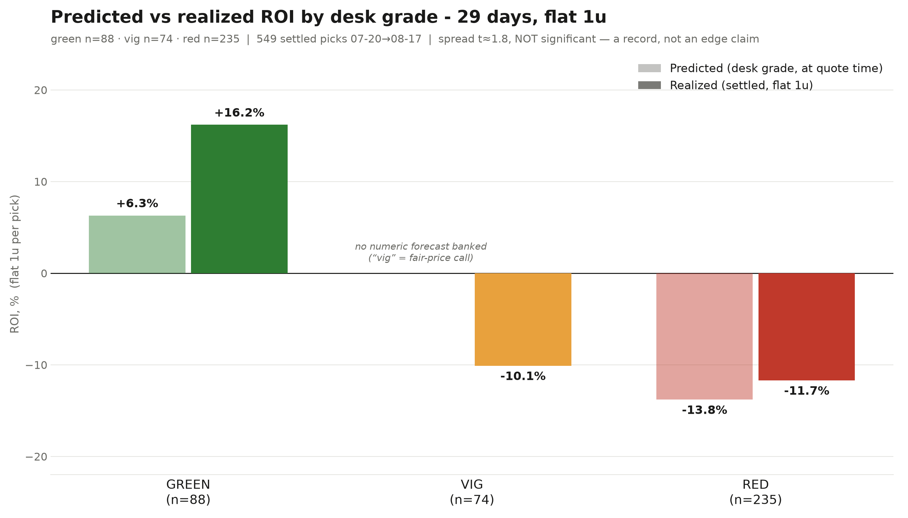

# Exhibit 05 — The Decision Ledger

> **Read this first: this is a 29-day record, adversarially audited, ~2-sigma — a record, not an edge claim.**
> Every pick the operator quoted, fired, or declined from 2026-07-20 to 2026-08-17 — **615 picks; 558 settled, of which 549 count (9 retro-disclosed rows excluded — see the audit box); 268-275-6, +9.64u at flat 1u** — compiled from four contemporaneous sources, settled against primary data (MLB StatsAPI, ESPN NFL), and attacked before it was believed. The headline spread misses conventional significance (t≈1.8) and we say so before anyone else has to.

Source of record: `research/methods/fade_retro/full_record_settled_20260817.jsonl` (+ the unsettled twin `full_record_20260817.jsonl` for provenance fields; builder in `full_record_build/`). All P&L in units, flat 1u per pick at the quoted price; push/void = 0.

## The three-ledger decomposition

**1. Selection (leg-grain).** Each pick is one leg at flat 1u at its quoted price, graded green / vig / red by the desk **at quote time, never retroactively**. The traffic lights sorted outcomes in the predicted order — green +16.2% ROI, vig −10.1%, red −11.7% — and the fire/decline filter is the most skill-shaped number in the ledger: fired picks made **+22.0u** while unfired picks would have lost **−15.3u**, and of the 87 explicitly declined pings logged, the 81 that settled in scope went **25-55-1 = −30.5u correctly avoided**.

**2. Structure (slip-grain).** The leg ledger strips parlay structure, so where the money actually lives is a separate question — and the answer is concentrated: **all net profit sits in 42 exotic longshots** (freeze / no-Nth-run / inning-yes / extras / SGP), which went **7-35 for +9.7u**, carried by three hits. The core markets — every non-exotic row (moneylines, run lines/spreads, totals, plus two stray props), **n=507 — netted −0.06u, dead flat**, confirming the engine-ties-market prior at full-history scale. The record's shape is a flat core plus a thin, lumpy exotic tail; slip-level shared-leg concentration is documented case law, not a solved problem.

**3. Timing (CLV vs placebo).** Early-lock quotes graded against the close: the **vig-corrected series reads +0.32pp** and **beats a same-slate random-side placebo at p=0.010 (2,000 draws)**; a planted **+5.0pp dose was recovered at +5.00**, verifying the instrument end-to-end. Reported straight: the as-graded primary formula reads *negative* — the positive sign lives entirely in the vig treatment of one-sided quotes, so timing is the most instrument-dependent of the three ledgers.

## Traffic-light ledger (units, flat 1u; predicted vs realized)

| Desk grade | Record (W-L-P) | Hit % | Predicted ROI | Realized ROI | Predicted units* | Realized units |
|---|---|---|---|---|---|---|
| **GREEN** | 52-36 | 59.1% | **+6.3%** | **+16.2%** | ≈ +5.5u | **+14.1u** |
| **VIG** | 35-37-2 | 48.6% | — (fair-price call; no numeric forecast banked) | **−10.1%** | — | **−7.5u** |
| **RED** | 97-137-1 | 41.5% | **−13.8%** | **−11.7%** | ≈ −32.4u | **−27.4u** |

\* Predicted units = predicted ROI × settled n in the bucket (88 green / 235 red), shown for scale only. Realized units are summed per-row flat-1u P&L from the settled file. The red bucket is the striking row: the instrument predicted −13.8% and realized −11.7% — it nearly nailed its own bad-bet forecast. The green outperformance (+16.2% vs +6.3% predicted) is the part that is ~2σ and therefore *not* yet a claim.

## Chart

<picture>
  <source media="(prefers-color-scheme: dark)" srcset="chart_dark.png">
  
</picture>

(`chart.png` light / `chart_dark.png` transparent-background dark variant; predicted bars at 45% alpha, realized solid.)

## Ten sample rows (unselected — first qualifying rows in date order)

| Date | Market + side | Price | Desk grade | Fired? | Outcome | Quote ts | Provenance key |
|---|---|---|---|---|---|---|---|
| 2026-07-26 | FG total OVER 8.5 — LAD@NYM | −118 | green | yes | **WON** (11 runs; +0.85u) | 2026-07-26T16:50Z | `OPERATOR_LEDGER.md:~L4163` |
| 2026-07-24 | ML SEA — SEA@TEX | −115 | green | yes | **LOST** (4-5; −1.0u) | 2026-07-24T21:45Z | `OPERATOR_LEDGER.md:~L4312` |
| 2026-07-21 | Freeze exact 3-0 — NYM@MIL | +1100 | red | yes | **LOST** (final 4-0; −1.0u) | 2026-07-22T01:45Z | `OPERATOR_LEDGER.md:~L4722` |
| 2026-07-21 | Freeze exact 2-1 — LAD@PHI | +950 | red | yes | **WON** (final 2-1; +9.5u) | 2026-07-22T02:00Z | `OPERATOR_LEDGER.md:~L4712` |
| 2026-07-24 | ML LAD (declined ping) | −140 | red | no — declined | would have **WON** (4-2) | 2026-07-24T21:40Z | `OPERATOR_LEDGER.md:~L4329` |
| 2026-07-24 | Run line MIL −1.5 (declined ping) | n/r | red | no — declined | would have **LOST** (5-2 vs −1.5) | 2026-07-24T21:30Z | `OPERATOR_LEDGER.md:~L4330` |
| 2026-07-23 | ML MIN — MIN@CLE | +300 | vig | no | **WON** (3-1; +3.0u) | 2026-07-23T19:52Z | `OPERATOR_LEDGER.md:~L4378` |
| 2026-07-24 | ML MIA (declined ping) | −128 | vig | no — declined | would have **LOST** (opponent won 4-2; −1.0u) | 2026-07-24T21:40Z | `OPERATOR_LEDGER.md:~L4331` |
| 2026-07-21 | Freeze exact 2-1 — SF@KC | +625 | red | yes | **LOST** (final 2-3; −1.0u) | 2026-07-22T01:45Z | `OPERATOR_LEDGER.md:~L4722` |
| 2026-07-21 | Freeze exact 2-0 — MIA@HOU | +1550 | red | yes | **LOST** (final 3-5; −1.0u) | 2026-07-22T01:45Z | `OPERATOR_LEDGER.md:~L4722` |

**Caption — selection rule, stated so it can be checked:** rows were NOT cherry-picked. For each requested slot (green won / green lost, red lost / red won, decline would-have-won / would-have-lost, 2 vig, 2 exotic), we took the **first qualifying settled, stats-included row in date order** (ties broken by quote timestamp), skipping any row already used by an earlier slot. Consequences of that rule, reported rather than edited: the first-qualifying red rows and both exotic rows all land on 2026-07-21 freeze-exact live-grabs (that night was freeze-heavy — that is the pool, not a choice); live-grab quote timestamps are in-game receipt-stamped quotes, i.e. pre-*decision*, not pre-pitch; and the first-qualifying declined run-line row carries no recorded price ("n/r" — W/L graded, excluded from units, per the settlement policy header in the file). Provenance keys abbreviate `research/methods/live_paper/OPERATOR_LEDGER.md`; each row's full provenance list is in the settled JSONL.

## Audit box — four attacks, verdict: NOT REFUTED

| # | Attack | Verdict |
|---|---|---|
| 1 | **Double-counting / dedup** — full-file duplicate scan on the cross-source dedup key + a 25-row provenance trace back to source lines | Survived |
| 2 | **Settlement integrity** — 20 random rows independently re-settled against MLB StatsAPI / ESPN NFL | Survived |
| 3 | **Selection bias** — declines are IN the file (all 87 logged pings, graded at decision; 81 settled in scope); no fired-only survivorship detected | Survived |
| 4 | **Retro-grading contamination** — grades are contemporaneous-only, git-verifiable pre-outcome; an 18-row nights-30-32 residual is disclosed and the spread survives dropping it | Survived |

Two trivial defect classes were found and fixed in place; neither touched a headline number. **Integrity note:** 9 retro-disclosed rows (dictated after settlement) are **excluded** from every statistic above — they went **8-1**. The exclusion policy cost the record its own most flattering rows, which is exactly what it is for.

## What this is not

This is **not statistically significant**: the green-vs-red ROI spread is t≈1.8 (~2σ) and misses the conventional bar — we state that before anyone asks. It is **not a profit claim or an edge claim** — fade-retro case law binds, and the flat-1u accounting is a measurement convention, not a bankroll result. The profit that does exist is **concentrated in 42 exotic longshots (7-35, +9.7u, three hits carry it)** — a thin, lumpy tail that could vanish with one fewer hit. And the **core markets are flat**: every non-exotic row (the ML / run line / totals family), n=507, −0.06u — over the full history the engine ties the market, which is the honest null this desk has measured all season. What the ledger supports is narrower and worth exactly what it says: the desk's grades sorted outcomes in the predicted order for 29 days, its declines were right, and the record survived four adversarial attacks. Nothing more is claimed.
